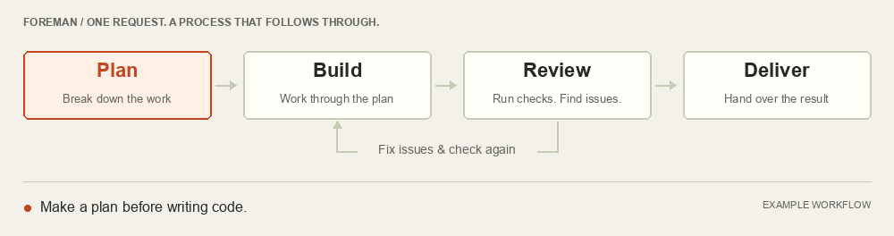

<p align="center">
  
</p>

<h1 align="center">Foreman</h1>

<p align="center"><strong>Your agent codes. Foreman keeps it on track.</strong></p>

> [!NOTE]
> **Powered by [Jev](https://typesafe.ai/).** Jev chooses the next step from the paths your workflow allows. Foreman checks required outputs, saves progress, and manages execution. A Jev API key (`TYPESAFE_API_KEY`) is required.

<p align="center">
  <a href="https://github.com/Harrison97/opencode-foreman/actions/workflows/ci.yml"></a>
  <a href="https://github.com/Harrison97/opencode-foreman/actions/workflows/pages.yml"></a>
  <a href="https://harrison97.github.io/opencode-foreman/"></a>
</p>

<p align="center">
  <a href="https://harrison97.github.io/opencode-foreman/">Website</a> ·
  <a href="#install">Quick start</a> ·
  <a href="docs/workflows.md">Workflow guide</a> ·
  <a href="docs/architecture/overview.md">Architecture</a>
</p>

Foreman is an **OpenCode plugin for structured, persistent workflows**. Describe what you want to build, and it guides your agent through planning, implementation, review, repair, and delivery.

OpenCode performs the work with your existing tools and models. Foreman tracks progress, checks required outputs, and manages the next step—with Jev choosing between allowed transitions.

<p align="center">
  
</p>

## Why Foreman

| Capability                   | What it gives you                                                  |
| ---------------------------- | ------------------------------------------------------------------ |
| **A process that continues** | Move through substantial work without prompting every step.        |
| **Review and repair**        | Check the work and send issues back before delivery.               |
| **Durable progress**         | Pause, resume, and inspect stage history and routing decisions.    |
| **Configurable workflows**   | Define instructions, outputs, checks, tools, and models per stage. |

Use the included engineering workflow immediately, or create your own process for research, writing, and other tasks. Small requests can bypass supervision.

> [!NOTE]
> **Plan for model usage.** Additional stages, reviews, and repair loops add model calls and can use substantial tokens. Monitor usage on longer workflows. Foreman does not guarantee lower cost or better code.

## Install

**Prerequisites:** macOS, Linux, or WSL; Git and npm; Node.js 22.13+ on 22.x or 24+; and an installed OpenCode.

```sh
curl -fsSL https://harrison97.github.io/opencode-foreman/install.sh | bash
```

The installer builds and registers Foreman and its terminal trace UI. Run the same command again to update. [Inspect the installer →](site/install.sh)

Set `TYPESAFE_API_KEY` in the environment that launches OpenCode, then restart OpenCode. Configure your coding model in OpenCode as usual—Foreman uses those existing credentials. Keep API keys out of workflow files.

<details>
<summary>Installation location and updates</summary>

The managed installation lives in `${XDG_DATA_HOME:-$HOME/.local/share}/opencode-foreman`. Existing OpenCode settings are preserved.

To choose another location, pass an absolute path to Bash:

```sh
curl -fsSL https://harrison97.github.io/opencode-foreman/install.sh | FOREMAN_INSTALL_DIR=/your/path bash
```

Updates replace the managed directory. Keep custom workflows in your projects, not in the installation directory.

The adapter is tested with OpenCode 1.18.31 and plugin SDK 1.18.30. See [UI compatibility](docs/sidebar.md) and [operations](docs/operations.md) for disabling and recovery.

</details>

<details>
<summary>Install from a development checkout</summary>

```sh
git clone https://github.com/Harrison97/opencode-foreman.git
cd opencode-foreman
npm ci && npm run install:local
```

Keep the checkout in place: the local installation points to its compiled files. Restart OpenCode after installation.

</details>

## Start a project

Open OpenCode in your project and describe the outcome you want:

> Build a local issue tracker with persistent storage, issue creation and editing, status and priority filters, and a polished interface. Make routine engineering decisions yourself.

The [default engineering workflow](docs/foreman.md) handles substantial requests without any YAML setup. Answer its product questions and let the workflow continue. A **Jev connected** notice confirms the first successful routing request; the trace shows progress through the stages.

### Workflow controls

Use these in **OpenCode chat**, not your shell:

| Message or command           | Action                                                           |
| ---------------------------- | ---------------------------------------------------------------- |
| `foreman: …`                 | Explicitly enter the workflow.                                   |
| `foreman bypass: …`          | Use normal OpenCode and detach supervision.                      |
| `stop`, `pause`, or `cancel` | Pause the run; a normal reply resumes it.                        |
| `foreman resume`             | Attach the latest paused run to a new conversation.              |
| `/foreman-trace`             | Open capability history in the terminal UI.                      |
| `/foreman-routing`           | Inspect routing inputs, exclusions, probabilities, and outcomes. |

## Customize your workflow

A workflow defines **capabilities**: instructions, expected outputs, optional models, checks, and allowed transitions. Configuration lives in `foreman.workflow.yaml` in the directory where OpenCode starts.

To adapt the default, copy the complete [`src/workflows/software-engineer/`](src/workflows/software-engineer/) directory—including its prompt files—into your project as `workflows/software-engineer/`, then reference it:

```yaml
source: workflows/software-engineer/workflow.yaml
```

Set `model: provider/model` on a capability to choose a configured OpenCode model. Omit it to inherit the selected model. Capabilities share the conversation.

<details>
<summary>Example: a minimal writing workflow</summary>

```yaml
version: 1
name: Writing assistant
admission:
  when: Substantial writing projects.
  bypass: Unrelated requests.
  entries: [draft]
capabilities:
  draft:
    purpose: Produce the requested document.
    instructions: Write DRAFT.md using the user's requirements.
    completion: The document addresses the requested scope.
    gate:
      files: [DRAFT.md]
    next:
      ready: [deliver]
      incomplete: [draft]
      blocked: [draft]
  deliver:
    purpose: Deliver the document.
    instructions: Summarize the result and link DRAFT.md.
    completion: The user has the result.
    dependsOn: [draft]
    terminal: true
```

The file gate checks that `DRAFT.md` exists; it does not judge writing quality.

</details>

Validate configuration from the Foreman checkout without calling a model:

```sh
npm run workflow:check -- /path/to/foreman.workflow.yaml
```

Restart OpenCode after editing configuration. New runs use the new definition; existing campaigns retain their saved workflow. There is no home-directory workflow discovery.

**[Read the workflow guide →](docs/workflows.md)**

## Reliability and limits

- **Routing:** Jev chooses the highest-ranked legal option. Transient routing failures retry, then pause visibly; credential errors pause immediately.
- **Verification:** Gates check configured evidence and outputs. Their strength depends on the checks and acceptance criteria you define.
- **State:** Progress and Jev usage live in the project's `.foreman/` directory. Never store credentials there.
- **Usage:** Run `npm run usage:jev -- /path/to/project` from the checkout to inspect Jev usage. Coding-model usage remains in OpenCode.

## Development checks

CI runs lint, formatting, type checking, tests, and a production build on Node.js 22 and 24 for pushes to `main` and pull requests. To run the same checks locally:

```sh
npm ci
npm run check
npm run build
```

## Documentation

| Guide                                          | Covers                                                         |
| ---------------------------------------------- | -------------------------------------------------------------- |
| [Workflows](docs/workflows.md)                 | YAML configuration, checks, transitions, and reusable packages |
| [Default engineering process](docs/foreman.md) | Bundled workflow behavior and limits                           |
| [Terminal UI](docs/sidebar.md)                 | Capability trace and compatibility                             |
| [Operations](docs/operations.md)               | Usage, recovery, disabling, and migration                      |
| [Development](docs/development.md)             | Local setup, testing, and repository layout                    |
| [Architecture](docs/architecture/overview.md)  | Core design and integration boundaries                         |
